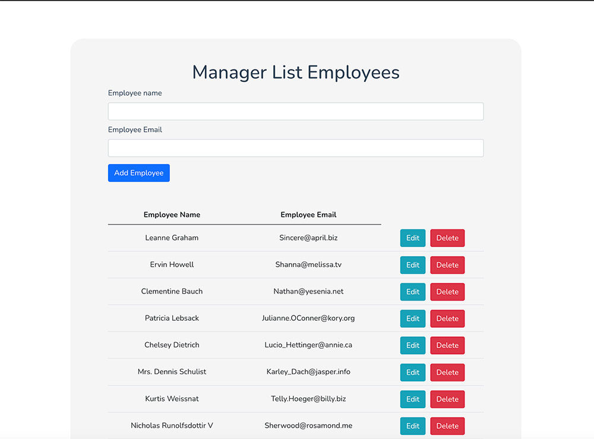

# Small CRUD Employee-list developed with Vue JS 2



## Project setup
```
npm install
```

### Compiles and hot-reloads for development
```
npm run serve
```

### Compiles and minifies for production
```
npm run build
```

### Lints and fixes files
```
npm run lint
```

## 👀 Json files by JsonPlaceholder - Free Fake Rest API
## 🚀 https://jsonplaceholder.typicode.com


## 👀 Boostrap-vue - Version 4
## 🚀 https://bootstrap-vue.org


### Customize configuration
See [Configuration Reference](https://cli.vuejs.org/config/).
